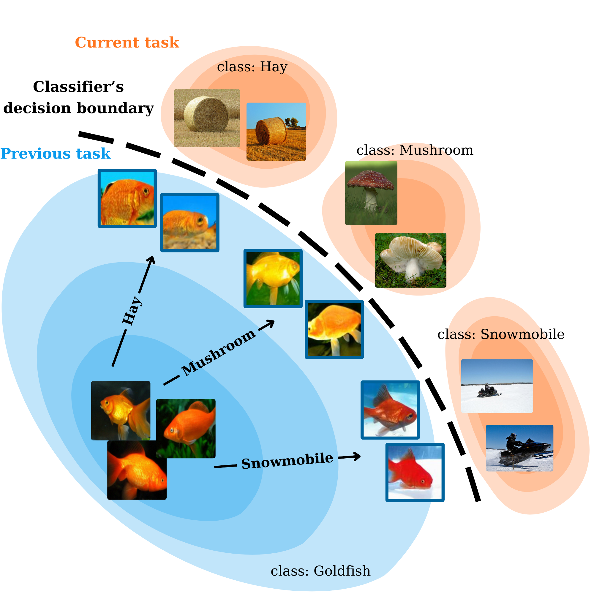

# GUIDE: Guidance-based Incremental Learning with Diffusion Models
[](https://arxiv.org/abs/2403.03938)

This repository is the official implementation of [GUIDE: Guidance-based Incremental Learning with Diffusion Models](https://arxiv.org/abs/2403.03938).



**Rehearsal sampling in GUIDE.**
We guide the denoising process of a diffusion model trained on the previous task (<span style="color:blue">blue</span>) toward classes from the current task (<span style="color:orange">orange</span>).
The replay samples, highlighted with <span style="color:blue">**blue borders**</span>, share features with the examples from the current task, which may be related to characteristics such as color or background (e.g., fishes on a snowy background when guided to *snowmobile*).
Continual training of a classifier on such samples positioned near its decision boundary successfully mitigates catastrophic forgetting.

## Setup

### Clone repo

```bash
git clone https://github.com/cywinski/guide.git
cd guide
```

### Prepare Conda environment

```bash
conda create -n guide_env python=3.8
conda activate guide_env
```

### Install torch

Install `torch` and `torchvision` according to instructions on [offical website](https://pytorch.org/).

### Install required **packages**

```
pip install .
```

### Login to wandb

```bash
wandb login
```

## Reproduction

Below we present training commands for a single GPU setup. To run the training in distributed manner, run the same command with `mpiexec`:

```bash
mpiexec -n $NUM_GPUS python scripts.image_train ...
```

When training in a distributed manner, you must manually divide the `--batch_size` argument by the number of ranks. In lieu of distributed training, you may use `--microbatch 16` (or `--microbatch 1` in extreme memory-limited cases) to reduce memory usage.

### Diffusion models training

Continual training of diffusion models with self-rehearsal. Trained models will be stored under `results/<wandb_experiment_name>`

**CIFAR-10/2**

```bash
python -m scripts.image_train --wandb_experiment_name=c10_ci2_class_cond_diffusion --wandb_project_name=project --wandb_entity=entity --batch_size=256 --num_steps=100000 --dataset=CIFAR10 --num_tasks=2 --save_interval=100000 --gr_n_generated_examples_per_task=25000 --first_task_num_steps=100000 --seed=0 --timestep_respacing=1000 --use_ddim=False --log_interval=1000 --cl_method=generative_replay --train_with_disjoint_classifier=False --embedding_kind=concat_time_1hot --train_aug=True
```

**CIFAR-10/5**

```bash
python -m scripts.image_train --wandb_experiment_name=c10_ci5_class_cond_diffusion --wandb_project_name=project --wandb_entity=entity --batch_size=256 --num_steps=50000 --dataset=CIFAR10 --num_tasks=5 --save_interval=50000 --gr_n_generated_examples_per_task=10000 --first_task_num_steps=100000 --seed=0 --timestep_respacing=1000 --use_ddim=False --log_interval=1000 --cl_method=generative_replay --train_with_disjoint_classifier=False --embedding_kind=concat_time_1hot --train_aug=True
```

**CIFAR-100/5**

```bash
python -m scripts.image_train --wandb_experiment_name=c100_ci5_class_cond_diffusion --wandb_project_name=project --wandb_entity=entity --batch_size=256 --num_steps=50000 --dataset=CIFAR100 --num_tasks=5 --save_interval=50000 --gr_n_generated_examples_per_task=10000 --first_task_num_steps=100000 --seed=0 --timestep_respacing=1000 --use_ddim=False --log_interval=1000 --cl_method=generative_replay --train_with_disjoint_classifier=False --embedding_kind=concat_time_1hot --train_aug=True
```

**CIFAR-100/10**

```bash
python -m scripts.image_train --wandb_experiment_name=c100_ci10_class_cond_diffusion --wandb_project_name=project --wandb_entity=entity --batch_size=256 --num_steps=100000 --dataset=CIFAR100 --num_tasks=10 --save_interval=100000 --gr_n_generated_examples_per_task=5000 --first_task_num_steps=100000 --seed=0 --timestep_respacing=1000 --use_ddim=False --log_interval=1000 --cl_method=generative_replay --train_with_disjoint_classifier=False --embedding_kind=concat_time_1hot --train_aug=True
```

**ImageNet100-64/5**

```bash
python -m scripts.image_train --wandb_experiment_name=i100_ci5_class_cond_diffusion --wandb_project_name=project --wandb_entity=entity --batch_size=100 --num_steps=50000 --dataset=ImageNet100 --num_tasks=5 --save_interval=50000 --gr_n_generated_examples_per_task=26000 --first_task_num_steps=100000 --seed=0 --timestep_respacing=ddim250 --use_ddim=True --log_interval=1000 --cl_method=generative_replay --train_with_disjoint_classifier=False --embedding_kind=concat_time_1hot --train_aug=True --attention_resolutions 32,16,8 --lr 1e-4 --resblock_updown True --use_new_attention_order True --use_scale_shift_norm True --num_channels 192 --num_head_channels 64
```

### Classifier trainings

Continual classifier trainings with generative replay according to GUIDE method. To run classifier trainings you first need to train the diffusion models (according to instructions presented above) and store `ema` checkpoints in `--diffusion_pretrained_dir`.

**CIFAR-10/2**

```bash
python -m scripts.image_train --wandb_experiment_name=c10_ci2_guide --wandb_project_name=project --wandb_entity=entity --batch_size=256 --dataset=CIFAR10 --num_tasks=2 --seed=0 --timestep_respacing=ddim50 --use_ddim=True --classifier_scale_min_new=0.2 --classifier_scale_max_new=0.2 --cl_method=generative_replay_disjoint_classifier_guidance --train_with_disjoint_classifier=True --use_old_grad=False --use_new_grad=True --guid_to_new_classes=True --embedding_kind=concat_time_1hot --classifier_init_lr=0.1 --classifier_lr=0.01 --disjoint_classifier_init_num_steps=5000 --disjoint_classifier_num_steps=2000 --classifier_augmentation=True --log_interval=200 --diffusion_pretrained_dir=results/c10_ci2_class_cond_diffusion
```

**CIFAR-10/5**

```bash
python -m scripts.image_train --wandb_experiment_name=c10_ci5_guide --wandb_project_name=project --wandb_entity=entity --batch_size=256 --dataset=CIFAR10 --num_tasks=5 --seed=0 --timestep_respacing=ddim50 --use_ddim=True --classifier_scale_min_new=0.5 --classifier_scale_max_new=0.5 --cl_method=generative_replay_disjoint_classifier_guidance --train_with_disjoint_classifier=True --use_old_grad=False --use_new_grad=True --guid_to_new_classes=True --embedding_kind=concat_time_1hot --classifier_init_lr=0.1 --classifier_lr=0.01 --disjoint_classifier_init_num_steps=5000 --disjoint_classifier_num_steps=2000 --classifier_augmentation=True --log_interval=200 --guid_generation_interval=5 --diffusion_pretrained_dir=results/c10_ci5_class_cond_diffusion
```

**CIFAR-100/5**

```bash
python -m scripts.image_train --wandb_experiment_name=c100_ci5_guide --wandb_project_name=project --wandb_entity=entity --batch_size=256 --dataset=CIFAR100 --num_tasks=5 --seed=0 --timestep_respacing=ddim100 --use_ddim=True --classifier_scale_min_new=0.5 --classifier_scale_max_new=0.5 --cl_method=generative_replay_disjoint_classifier_guidance --train_with_disjoint_classifier=True --use_old_grad=False --use_new_grad=True --guid_to_new_classes=True --embedding_kind=concat_time_1hot --classifier_init_lr=0.1 --classifier_lr=0.05 --disjoint_classifier_init_num_steps=10000 --disjoint_classifier_num_steps=2000 --classifier_augmentation=True --log_interval=200 --guid_generation_interval=10 --diffusion_pretrained_dir=results/c100_ci5_class_cond_diffusion
```

**CIFAR-100/10**

```bash
python -m scripts.image_train --wandb_experiment_name=c100_ci10_guide --wandb_project_name=project --wandb_entity=entity --batch_size=256 --dataset=CIFAR100 --num_tasks=10 --seed=0 --timestep_respacing=ddim100 --use_ddim=True --classifier_scale_min_new=1.0 --classifier_scale_max_new=1.0 --cl_method=generative_replay_disjoint_classifier_guidance --train_with_disjoint_classifier=True --use_old_grad=False --use_new_grad=True --guid_to_new_classes=True --embedding_kind=concat_time_1hot --classifier_init_lr=0.1 --classifier_lr=0.05 --disjoint_classifier_init_num_steps=10000 --disjoint_classifier_num_steps=2000 --classifier_augmentation=True --log_interval=200 --guid_generation_interval=10 --diffusion_pretrained_dir=results/c100_ci10_class_cond_diffusion
```

**ImageNet100-64/5**

```bash
python -m scripts.image_train --wandb_experiment_name=i100_ci5_guide --wandb_project_name=project --wandb_entity=entity --batch_size=100 --dataset=ImageNet100 --num_tasks=5 --seed=0 --timestep_respacing=ddim50 --use_ddim=True --classifier_scale_min_new=1.0 --classifier_scale_max_new=1.0 --cl_method=generative_replay_disjoint_classifier_guidance --train_with_disjoint_classifier=True --use_old_grad=False --use_new_grad=True --guid_to_new_classes=True --embedding_kind=concat_time_1hot --classifier_init_lr=0.1 --classifier_lr=0.001 --disjoint_classifier_init_num_steps=20000 --disjoint_classifier_num_steps=20000 --classifier_augmentation=False --log_interval=200 --guid_generation_interval=15 --attention_resolutions 32,16,8 --lr 1e-4 --resblock_updown True --use_new_attention_order True --use_scale_shift_norm True --num_channels 192 --num_head_channels 64 --diffusion_pretrained_dir=results/i100_ci5_class_cond_diffusion
```


## BibTeX

If you find this work useful, please consider citing it:

```bibtex
@article{cywinski2024guide,
  title={GUIDE: Guidance-based Incremental Learning with Diffusion Models},
  author={Cywi{\'n}ski, Bartosz and Deja, Kamil and Trzci{\'n}ski, Tomasz and Twardowski, Bart{\l}omiej and Kuci{\'n}ski, {\L}ukasz},
  journal={arXiv preprint arXiv:2403.03938},
  year={2024}
}
```

## Acknowledgments

This codebase borrows from [OpenAI's guided diffusion repo](https://github.com/openai/guided-diffusion) and [Continual-Learning-Benchmark repo](https://github.com/GT-RIPL/Continual-Learning-Benchmark).
